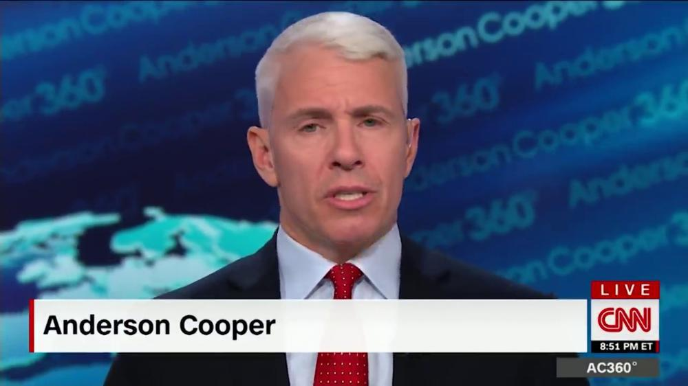
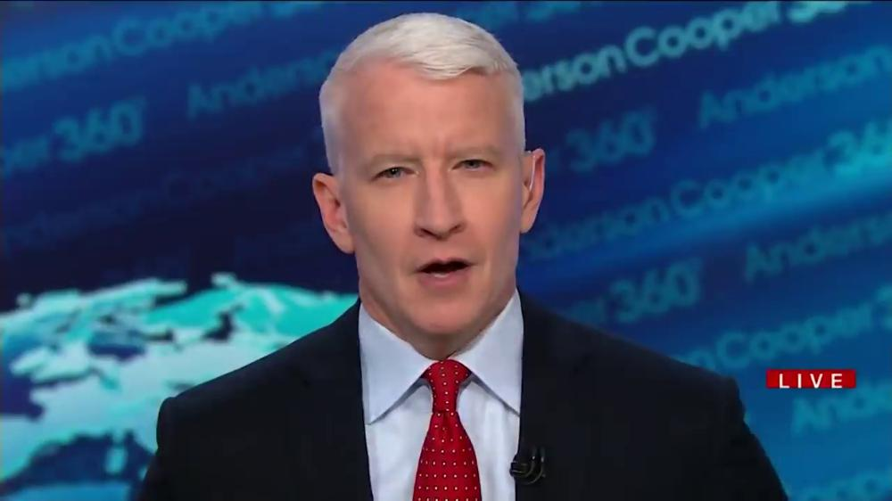

# Pytorch based face replacement kit

This is a pytorch based toolkit that can be used for face replacement. It is
used for research and learning.

## Description

This toolkit allows you to use pytorch to perform face replacement. It offers
simple code that can grab two videos and replace the faces from one person
in video A into the faces from another person in video B.

I built this toolkit while learning pytorch. I did not build my own face
predictor to detect the faces, for that I used codeniko's landmarks_81 predictor.
```
https://github.com/codeniko/shape_predictor_81_face_landmarks
```

In this toolkit I built pytorch scripts that cut videos into list of images that
can be used for training to "learn" two people's face landamrks. Then can
replace one persons face into the target person's face respecting face
orientation and facial expression. It does this by on each image replacing the
target person's face with the best approximate face it finds from the source
person's face. After all the images of the target video are independently
face-replaced, there is a pytorch script that puts all the images together into
a video.

Below is a sample result:
<p align="center">
    
 </p>

from:
<p align="center">
    
 </p>

The individual image results sometimes look OK. For video is not good at all
because there is often too much change from one face to the next according to
the landmarks.

## Requires
I used a Mac OS so to install dlib in Mac OS, I used these fantastic
instructions:
https://www.learnopencv.com/install-dlib-on-macos/

This environment will support running the face landmark script that I leveraged,
create_landmark_dataset_81.py
```
workon facecourse-py3
```

Install PyAV for torchvision io video. Used instructions in:
https://github.com/mikeboers/PyAV#installation

There may be a bug in torchvision related to the audio code. Since I didn't use
audio, I overwrote that file to not do audio and avoid the error.
I did (but you may not need to):
```
sed -i 's/if container.streams.audio:/if False:/g' /Users/USER_NAME/anaconda2/lib/python2.7/site-packages/torchvision/io/video.py
```

## Sample usage

To extract the images labeled lexicographically in order run
```
python video_read.py -f data/videos/vid.mp4 -o data/faces -p faces_name -m 100000 -r 10000
```
Be sure to set the arguments for both videos depending on the results.
Particularly different videos may have different number of points per frame.

To learn the face landmarks you need to enter the dlib-enabled python
environment. You need to create landmarks for both sets of faces.
So open a separate terminal and run:
```
workon facecourse-py3
python create_landmark_dataset_81.py -i data/faces_person_1
```

Once the landamark csv files are created, it's time to run the face replacer
script:
```
python replace_faces.py -s data/faces/person_a/ -t data/faces/person_b/ -o output/dir/ -f result
```
The resulting images will be created in the output/dir/ with names like,
result_100000, result_100001, etc depending on your args.

Once the resulting images are done you could put them together in a video:
```
python write_video.py -s input_dir -o output_dir -f video_name
```

This will create a video like video_name.mp4. As you would see the individual
images may look better than the resulting video.

The other scripts not referenced here so far (like crop_face and show_landmarks)
is here just for fun and is not needed for the face replacement.
